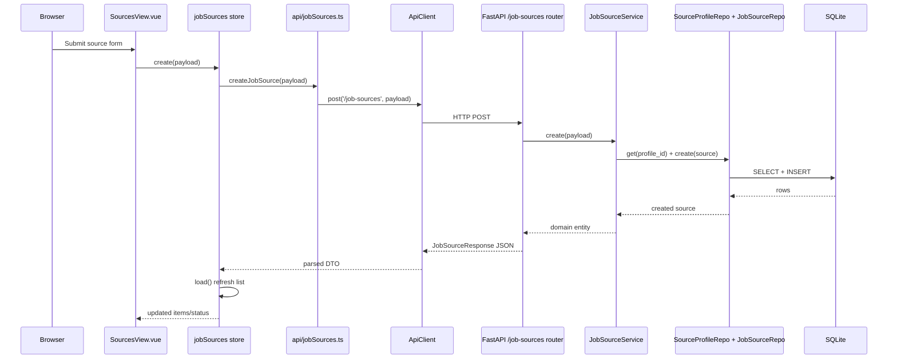
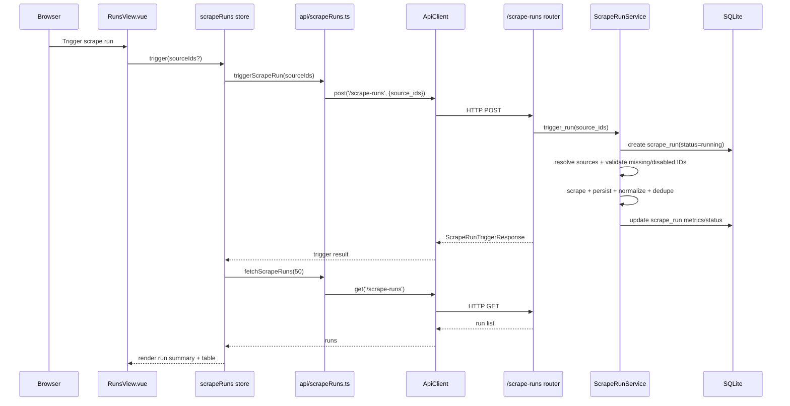
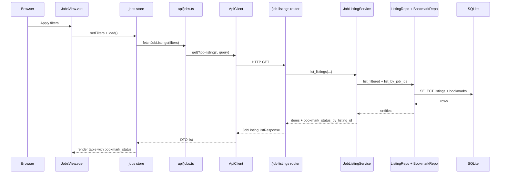
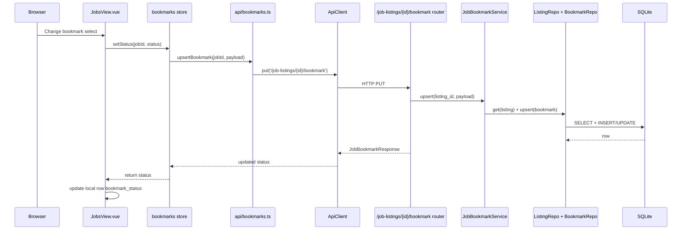
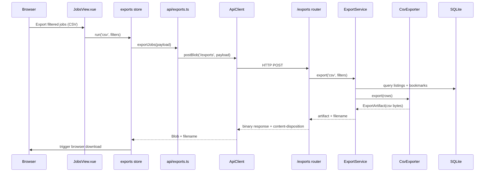

# Data Flow

This document traces implemented runtime flows across browser, frontend, backend, and database.

## A. Create Job Source

## B. Run Scrape

## C. Third-Party API Fetch
File path focus:
- `backend/app/scrapers/profiles/greenhouse_adapter.py`
- `backend/app/scrapers/profiles/lever_adapter.py`

Flow:
1. `ScrapeRunService` resolves source profile.
2. `ScraperRegistry` resolves adapter by profile code.
3. Adapter chooses `mode` (`fixture` or `live`).
4. In live mode, adapter uses `httpx.Client(...).get(jobs_url)`.
5. Adapter validates response shape and emits `ScrapedRecord[]`.

## D. RawJob Persistence
File:
- `backend/app/services/scrape_run_service.py`
- `backend/app/repositories/raw_job_repo.py`

Flow:
1. For each `ScrapedRecord`, service computes `payload_hash`.
2. Service creates `RawJob` via `SQLAlchemyRawJobRepository.create`.
3. `raw_jobs` row captures provider payload and scrape timestamp.

## E. Normalization
File:
- `backend/app/services/normalization_service.py`

Flow:
1. Service reads profile-specific preferred keys for title/company.
2. Reads location/work mode from multiple candidate fields.
3. Normalizes posted datetime and string lists.
4. Produces `NormalizedJobData`.

## F. Dedupe / Upsert
File:
- `backend/app/services/dedupe_service.py`

Flow:
1. Generate canonical key priority:
   - external ref
   - apply URL
   - fallback hash(title/company/location)
2. Look up existing listing by canonical key.
3. Insert new listing or update mutable fields + `last_seen_at`.
4. Return action: `inserted`, `updated`, or `duplicate`.

## G. Job Listing Display

## H. Bookmark Update

## I. CSV Export

## J. XLSX Export
Same flow as CSV, but `ExporterRegistry` resolves `XlsxExporter`.

Files:
- `backend/app/exporters/registry.py`
- `backend/app/exporters/xlsx_exporter.py`

## Cross-Layer Notes
- Browser/UI bookmark value and export bookmark value are both based on persisted bookmark state.
- Selected source scrape now reports missing/disabled IDs explicitly in run failures.
