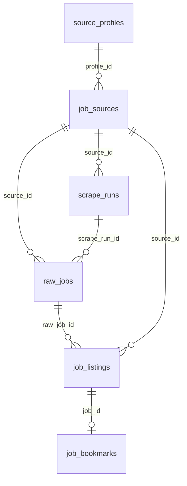

# Database and Migrations

## Database Stack
- ORM: SQLAlchemy 2.x (`backend/app/db/models/*.py`)
- Migration tool: Alembic (`backend/alembic/*`)
- Default DB: SQLite (`sqlite:///./job_scraper_dashboard.db`)

## Laravel Mapping
| Laravel | This Project |
|---|---|
| Eloquent Model | SQLAlchemy model class |
| Migration file | Alembic revision file |
| Seeder class | Seed functions in `backend/app/db/seeds.py` + migration seed insert |
| DB connection config (`config/database.php`) | `backend/app/core/config.py` + `backend/app/db/session.py` |

## Model and Session Usage
File: `backend/app/db/session.py`

Purpose:
- Creates SQLAlchemy engine from `JSD_DATABASE_URL` / default.
- Creates `SessionLocal` factory.
- Exposes request-scoped session generator `get_db()`.

File: `backend/app/db/base.py`

Purpose:
- Declares `Base` with naming conventions.
- Provides `TimestampMixin` for created/updated timestamps.

## Migration Workflow
Migration file:
- `backend/alembic/versions/20260526_0001_initial_schema.py`

Creates tables and indexes for:
- `source_profiles`
- `job_sources`
- `scrape_runs`
- `raw_jobs`
- `job_listings`
- `job_bookmarks`

Also inserts initial source profiles (`greenhouse`, `lever`, `custom-html`).

## Seed Workflow
File: `backend/app/db/seeds.py`

Functions:
- `seed_source_profiles(session)`
- `seed_job_sources(session)`

Execution:
- Called during FastAPI lifespan startup in `backend/app/main.py`.
- Idempotent checks avoid duplicate inserts.

## Table-by-Table Documentation

### 1) `source_profiles`
Purpose:
- Lookup table for scraper profile types.

Key fields:
- `id`
- `code` (unique)
- `display_name`
- `active`
- `created_at`, `updated_at`

Relationships:
- Referenced by `job_sources.profile_id`.

Lifecycle:
- Seeded initially and used to bind source rows to adapter profile codes.

### 2) `job_sources`
Purpose:
- User-configured source endpoints + scraper config.

Key fields:
- `id`, `name`, `base_url`
- `profile_id` FK -> `source_profiles.id`
- `enabled`
- `config` (JSON)
- timestamps

Relationships:
- Parent for `scrape_runs.source_id` (nullable).
- Parent for `raw_jobs.source_id` and `job_listings.source_id`.

Lifecycle:
- Created/updated/deleted via `/job-sources` API.
- Selected by scrape service based on enabled flag and requested IDs.

### 3) `scrape_runs`
Purpose:
- Stores execution metadata for each triggered scrape run.

Key fields:
- `status` (`running/completed/failed` in current behavior)
- timing: `started_at`, `ended_at`, `duration_ms`
- metrics: `records_seen`, `records_inserted`, `records_updated`, `duplicates`, `failures`
- `error_summary`

Lifecycle:
- Inserted at run start.
- Updated after processing with final status/metrics.

### 4) `raw_jobs`
Purpose:
- Immutable-ish capture of fetched record payloads per run.

Key fields:
- `source_id`, `scrape_run_id`
- `external_ref`
- `source_snapshot`
- `raw_payload` JSON
- `payload_hash`
- `scraped_at`

Lifecycle:
- One row per scraped record persists before normalization/dedupe.

### 5) `job_listings`
Purpose:
- Normalized, deduplicated listings used by UI and export.

Key fields:
- `canonical_key` (unique)
- presentation fields (`title`, `company`, `location`, etc.)
- arrays `tags`, `skills` as JSON
- `first_seen_at`, `last_seen_at`
- `is_active`

Lifecycle:
- Upserted by dedupe service.
- Queried by filters for Jobs UI and exports.

### 6) `job_bookmarks`
Purpose:
- Per-listing user bookmark status and notes.

Key fields:
- `job_id` unique FK -> `job_listings.id`
- `status`
- `notes`
- `updated_at`

Lifecycle:
- Upserted by bookmark endpoint.
- Joined into listing response and export rows.

## ERD

## Known Limitations
- SQLite is the default and may not fit high-concurrency production workloads.
- No soft-delete columns; source/listing lifecycle is controlled by existing fields and hard delete for job sources.
