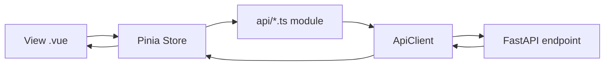

# Frontend Architecture

## Purpose
The frontend is a Vue 3 SPA that organizes route views, state stores, and API access into separate layers.

## Bootstrap Process
File: `frontend/src/main.ts`

Purpose:
- Creates Vue app instance.
- Registers Pinia and Vue Router.
- Mounts `App.vue`.
- Loads global styles (`styles.css`).

## Router Setup
File: `frontend/src/router/index.ts`

Purpose:
- Declares routes:
  - `/jobs`
  - `/sources`
  - `/runs`
- Redirects `/` -> `/jobs`.

Why:
- Keeps top-level screen navigation explicit and centralized.

## View Layer
Folder: `frontend/src/views`

Views:
- `SourcesView.vue`: source CRUD form and table.
- `RunsView.vue`: scrape trigger and run history.
- `JobsView.vue`: listing filters, bookmark updates, exports.

Why views stay thin:
- Views mostly gather input, call store actions, and render state.
- Async logic and status handling are delegated to stores.

## Component Layer
Folder: `frontend/src/components`

Shared components in `frontend/src/components/shared`:
- `ActionButton.vue`
- `DataTable.vue`
- `LoadingState.vue`
- `ErrorState.vue`
- `EmptyState.vue`
- `FormField.vue`

Why shared components exist:
- Reuse styling and behavior for repeated UI patterns.
- Reduce per-view template duplication.

## Pinia Stores
Folder: `frontend/src/stores`

Stores and responsibilities:
- `sourceProfiles.ts`: load source profile options.
- `jobSources.ts`: CRUD source records + validation error extraction.
- `scrapeRuns.ts`: trigger runs + load run history.
- `jobs.ts`: manage listing filters and listing load.
- `bookmarks.ts`: bookmark write operation status.
- `exports.ts`: export download action and status.

Why stores own business state:
- Central place for async state (`idle/loading/success/error`).
- Shared state across view sections.
- Predictable side-effect handling.

## API Client and Endpoint Modules
### API Client
File: `frontend/src/api/client.ts`

Purpose:
- Provides typed wrappers for GET/POST/PATCH/PUT/DELETE and blob responses.
- Uses `VITE_API_BASE_URL` or defaults to `http://localhost:8000`.
- Throws `ApiError` on non-2xx.

### Endpoint Modules
Folder: `frontend/src/api`

Modules:
- `sourceProfiles.ts`
- `jobSources.ts`
- `scrapeRuns.ts`
- `jobs.ts`
- `bookmarks.ts`
- `exports.ts`

Why API calls are centralized:
- Stable path definitions in one place.
- Stores are not coupled to raw URL strings.
- Easier request contract updates.

## Composables
Folder: `frontend/src/composables`

Current state:
- `useFilters.ts` and `useExport.ts` are present as lightweight type/state placeholders and are not primary runtime orchestration points.

## Tailwind Usage
- Global utility styling in `frontend/src/styles.css`.
- Components and views use utility classes directly.
- Tailwind configured via `tailwind.config.js`.

## Frontend Layer Interaction Diagram

## Laravel-Oriented Mapping
| Laravel + Vue Pattern | This Project |
|---|---|
| Page component | `views/*.vue` |
| Shared UI components | `components/shared/*.vue` |
| Axios service module | `api/*.ts` + `api/client.ts` |
| Store (Pinia/Vuex) | `stores/*.ts` |
| Route definitions | `router/index.ts` |

## Known Limitations
- No frontend E2E suite.
- Error messages from backend are mostly surfaced as raw response text unless explicitly parsed (job source store parses JSON validation payloads).
