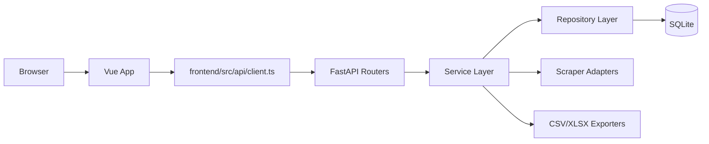
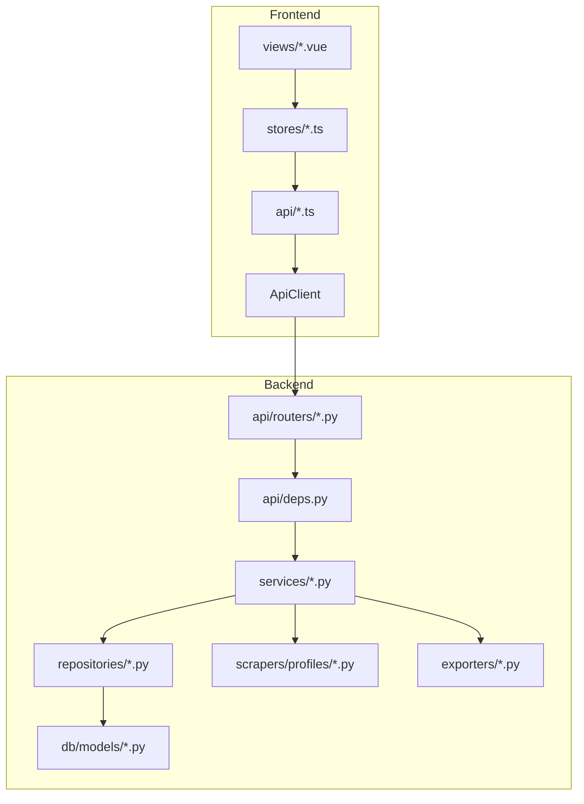

# Overview

## What This Application Does
The project is a job scraping dashboard with a FastAPI backend and a Vue 3 frontend.

Users can:
1. Configure job sources (with source profile + config JSON).
2. Trigger synchronous scrape runs.
3. View normalized job listings.
4. Set bookmark status per job.
5. Export filtered listings to CSV or XLSX.

## Core User Workflow
1. Open **Sources** view and create/update job sources.
2. Open **Runs** view and trigger a scrape run for all enabled sources or selected source IDs.
3. Open **Jobs** view and filter listings.
4. Update bookmark status (`new`, `interested`, `applied`, `rejected`).
5. Export filtered jobs from Jobs view.

## High-Level Architecture
- Backend owns domain logic, data persistence, scraping orchestration, normalization/dedupe, and export generation.
- Frontend owns UI composition, route navigation, local interaction state, and API invocation.

## Component Interaction

## Backend Responsibilities
- Request routing and response modeling.
- Validation via Pydantic schemas and service-level config validation.
- DB read/write through repository classes.
- Scrape run orchestration and metrics.
- Export file generation and binary response.

Key files:
- `backend/app/main.py`
- `backend/app/api/routers/*.py`
- `backend/app/services/*.py`
- `backend/app/repositories/*.py`
- `backend/app/db/models/*.py`

## Frontend Responsibilities
- Route-level screens and user interaction flow.
- API module usage and error/status handling.
- Store state for sources, runs, jobs, bookmarks, exports.

Key files:
- `frontend/src/main.ts`
- `frontend/src/router/index.ts`
- `frontend/src/views/*.vue`
- `frontend/src/stores/*.ts`
- `frontend/src/api/*.ts`

## Scraping Responsibilities
- Resolve target sources.
- Enforce enabled-source-only scraping.
- Report missing/disabled selected source IDs as failures.
- Fetch/parse records via profile-specific adapter.
- Persist `raw_jobs`, normalize, dedupe/upsert `job_listings`, update run metrics.

Key files:
- `backend/app/services/scrape_run_service.py`
- `backend/app/scrapers/contracts.py`
- `backend/app/scrapers/registry.py`
- `backend/app/scrapers/profiles/*.py`

## Export Responsibilities
- Fetch filtered listings.
- Join bookmark status from `job_bookmarks`.
- Render CSV or XLSX.
- Return binary payload with download filename.

Key files:
- `backend/app/services/export_service.py`
- `backend/app/exporters/csv_exporter.py`
- `backend/app/exporters/xlsx_exporter.py`
- `backend/app/api/routers/exports.py`

## Why FastAPI Is Structured This Way
- Routers remain thin (transport and schema mapping only).
- Services contain orchestration/business behavior.
- Repositories isolate SQLAlchemy querying.
- `api/deps.py` composes object graphs per request.

This mirrors a Laravel style where controllers are thin and services/repositories hold domain behavior.

## Why Vue Is Structured This Way
- Views define route-level UX only.
- Stores hold async status, errors, and business-ish client state.
- API modules centralize endpoint paths and payload contracts.
- Shared components keep repeated UI scaffolding DRY.

This resembles Laravel + Inertia/Vue teams that keep HTTP concerns in one place and state transitions in store-like layers.

## Known Limitations (Current Implementation)
- Scrape execution is synchronous request-time work.
- No auth/authz.
- SQLite default storage.
- No E2E browser test suite.
- Exports are generated in-memory for requested result window.
