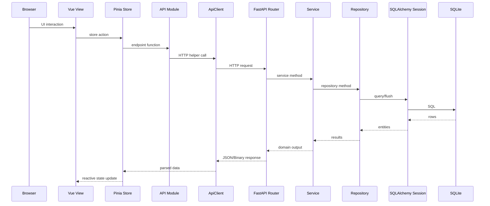
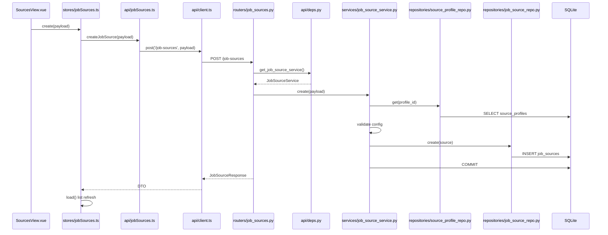
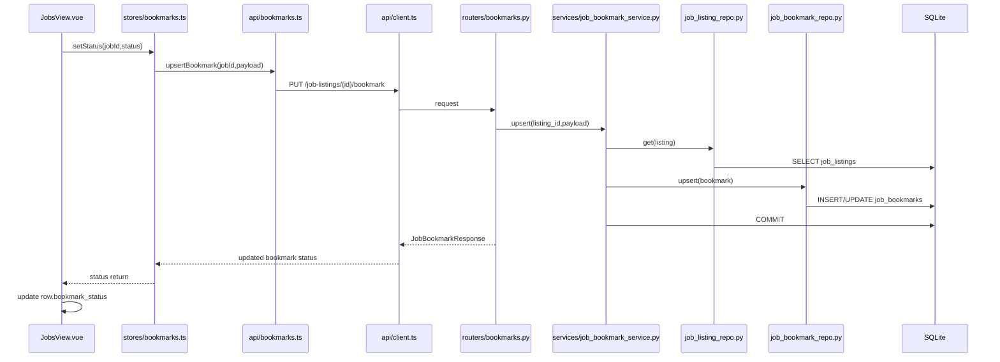
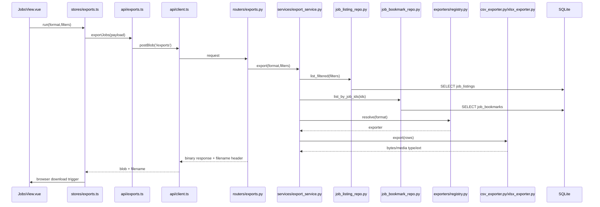

# Request Lifecycle

This document shows end-to-end request handling from browser UI to SQLite and back.

## Common Path Template


## Create Source Lifecycle


## Run Scrape Lifecycle
```mermaid
sequenceDiagram
  participant V as RunsView.vue
  participant S as stores/scrapeRuns.ts
  participant M as api/scrapeRuns.ts
  participant C as api/client.ts
  participant R as routers/scrape_runs.py
  participant SV as services/scrape_run_service.py
  participant REG as scrapers/registry.py
  participant AD as scrapers/profiles/*
  participant RR as raw_job_repo.py
  participant DS as dedupe_service.py
  participant LR as job_listing_repo.py
  participant DB as SQLite

  V->>S: trigger(sourceIds?)
  S->>M: triggerScrapeRun(sourceIds)
  M->>C: POST /scrape-runs
  C->>R: request
  R->>SV: trigger_run(source_ids)
  SV->>DB: INSERT scrape_runs(status=running)
  SV->>SV: resolve selected IDs; mark missing/disabled failures
  loop each resolved enabled source
    SV->>REG: get(profile_code)
    REG-->>SV: adapter
    SV->>AD: scrape(source)
    AD-->>SV: ScrapedRecord[]
    loop each record
      SV->>RR: create(raw_job)
      RR->>DB: INSERT raw_jobs
      SV->>DS: normalize + canonical key + upsert
      DS->>LR: select/create/update listing
      LR->>DB: SELECT/INSERT/UPDATE job_listings
    end
  end
  SV->>DB: UPDATE scrape_runs(metrics,status)
  R-->>C: ScrapeRunTriggerResponse
  C-->>S: trigger result
  S->>M: fetchScrapeRuns
  M->>C: GET /scrape-runs
  C-->>S: runs
```

## Bookmark Update Lifecycle


## Export Lifecycle


## Laravel Concept Mapping for Lifecycle
- Vue View + Store + API module ~= Blade/SPA UI + client service abstraction.
- FastAPI Router ~= Laravel Controller action.
- Service layer ~= Laravel Service class.
- Repository layer ~= Laravel Repository pattern.
- SQLAlchemy session/model ~= Eloquent/Query Builder execution path.
