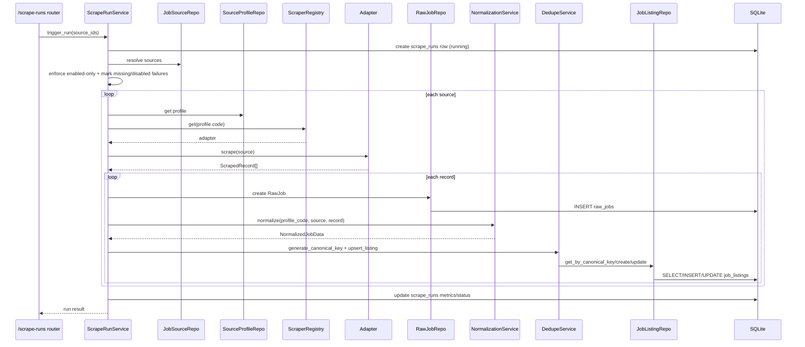

# Scraping Pipeline

## Overview
Scraping is orchestrated by `ScrapeRunService` and composed from profile-based adapters, normalization, and dedupe/upsert.

## Core Domain Objects

### SourceProfile
File: `backend/app/db/models/source_profile.py`

Purpose:
- Defines profile code (`greenhouse`, `lever`, `custom-html`) used for adapter selection.

### JobSource
File: `backend/app/db/models/job_source.py`

Purpose:
- User-configured source record containing `base_url`, `enabled`, and JSON `config`.

### ScraperAdapter Contract
File: `backend/app/scrapers/contracts.py`

Purpose:
- Protocol requiring `profile_code` and `scrape(source) -> list[ScrapedRecord]`.

Why:
- Ensures adapter implementations expose identical interface to orchestration layer.

### ScrapedRecord
File: `backend/app/scrapers/contracts.py`

Fields:
- `external_ref`
- `raw_payload`
- `source_snapshot`
- `scraped_at`

Purpose:
- Common in-memory format between adapters and pipeline.

## Adapter Implementations

### Greenhouse
File: `backend/app/scrapers/profiles/greenhouse_adapter.py`

Modes:
- `fixture`: read `config.fixtures` list.
- `live`: GET `config.jobs_url`, expect object with `jobs` list.

### Lever
File: `backend/app/scrapers/profiles/lever_adapter.py`

Modes:
- `fixture`: read `config.fixtures` list.
- `live`: GET `config.jobs_url`, expect list payload or object with `data` list.

### Custom HTML
File: `backend/app/scrapers/profiles/custom_html_adapter.py`

Behavior:
- Fixture-style parsing from `config.fixtures`.
- No live HTTP branch in current implementation.

## Registry
File: `backend/app/scrapers/registry.py`

Purpose:
- Maps `profile_code` -> adapter instance.

Used by:
- `ScrapeRunService.trigger_run`.

## Pipeline Sequence

## Why Adapters Are Isolated
- Provider payload formats vary.
- HTTP response shape and required fields differ by provider.
- Isolation avoids provider conditionals spreading into service logic.

## Why RawJob and JobListing Are Separate
- `RawJob` preserves source payload provenance.
- `JobListing` provides normalized/deduped query surface for UI/export.
- Separation supports traceability and cleaner downstream filtering.

## Normalization Behavior
File: `backend/app/services/normalization_service.py`

What it does:
- Selects title/company keys by profile.
- Resolves location and work mode from several payload structures.
- Parses datetime strings into UTC-aware datetimes.
- Normalizes `tags`/`skills` as string arrays.

## Dedupe Behavior
File: `backend/app/services/dedupe_service.py`

Key rules:
1. Canonical key based on:
   - external ref hash, else
   - apply URL hash, else
   - fallback hash(title+company+location)
2. Existing listing:
   - field changes -> `updated`
   - no field changes -> `duplicate`
3. New key -> `inserted`

## Metrics Calculation
File: `backend/app/services/scrape_run_service.py`

Counters:
- `records_seen`: scraped records count
- `records_inserted` / `records_updated` / `duplicates`: dedupe outcome counts
- `failures`: missing source IDs, disabled selected IDs, missing profiles, adapter exceptions

Run status:
- `failed` if failures > 0
- `completed` otherwise

## Known Limitations
- Scrape execution is synchronous.
- Adapter exceptions are collapsed into string summaries in `error_summary`.
